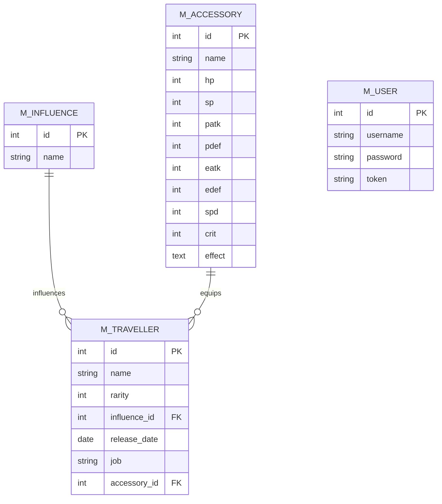

# ctc-db

## Database Schema

### Entity Relationship Diagram

```mermaid
erDiagram
    M_INFLUENCE ||--o{ M_TRAVELLER : influences
    M_ACCESSORY ||--o{ M_TRAVELLER : equips
    
    M_INFLUENCE {
        int id PK
        string name
    }
    
    M_TRAVELLER {
        int id PK
        string name
        int rarity
        int influence_id FK
        date release_date
        string job
        int accessory_id FK
    }
    
    M_USER {
        int id PK
        string username
        string password
        string token
    }
    
    M_ACCESSORY {
        int id PK
        string name
        int hp
        int sp
        int patk
        int pdef
        int eatk
        int edef
        int spd
        int crit
        text effect
    }
```